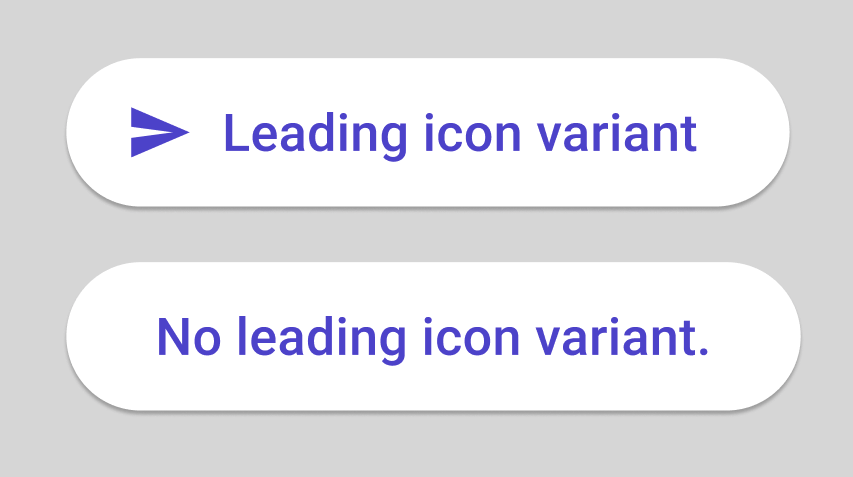
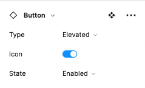

# How to Use Components

## Overview

Components are elements that can be reused across designs. They help to create and manage consistent designs across projects and produce optimal XAML output. Uno toolkit comes with a huge library of ready-to-use components. They can be seen all at once on the *Components* page of the Figma Uno Toolkit. Component instances have a `◇ (Diamond icon)` before their names in the *Layers* pane.

Once a component is brought into a design page it becomes an **Instance** of its **Main Component**. Instances can be individually edited without affecting each other while editing a *Main Component* will propagate changes across all of its instances.

Most Toolkit Components have **Variants**. Variants are very powerful time savers as they allow a single component to house various states and variations with specific attributes that the user may toggle on and off. e.g.: button components have a Leading Icon variant so you can use the same element with or without icons throughout the design.

All variants are children of a *Main Component* and all of those *Main Components* are children of an **Editable Template**. Editing an *Editable Template* will update all of it’s *Main components* and *Variants* but none of their instances. Templates have a ❖(4 Diamonds icon) before their name in the *Layers* pane.

## General Guidelines

- Never detach a component instance from its main component to ensure proper XAML generation from the UNO plugin
- Avoid editing the Component Templates from the Components Page, this may have unintended consequences on your design and the XAML output.

### Steps to add components to a design

1. Click on the page used for the design;
2. Open the *Assets* Tab at the top of the *Layers* pane;
3. Expand *Local Components;*
4. Drag the desired component into the canvas
5. Select desired variant from the Figma Design panel on the left of your monitor
   

> [!NOTE]
> Drag, don’t click. Clicking the component will bring you to the Components page and you will have to navigate back to your design page.**Overview**

### Overriding Component Properties
 
 Besides the existent component collection has been carefully designed, users are allowed to override the value of visual properties in some components. For instance, user can choose a different color for the background of an **Instance**, since the new value already exists in the design system. The properties that are allowed to be overrided are listed in the description page of each component.

> [!NOTE]
> Changing properties not listed as available to be overritten may compromise your design and XAML output. 